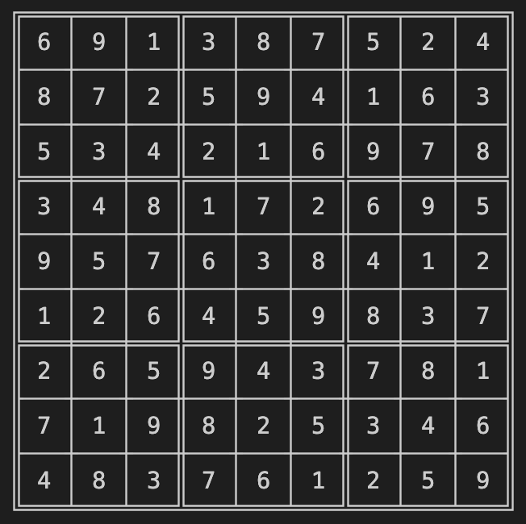
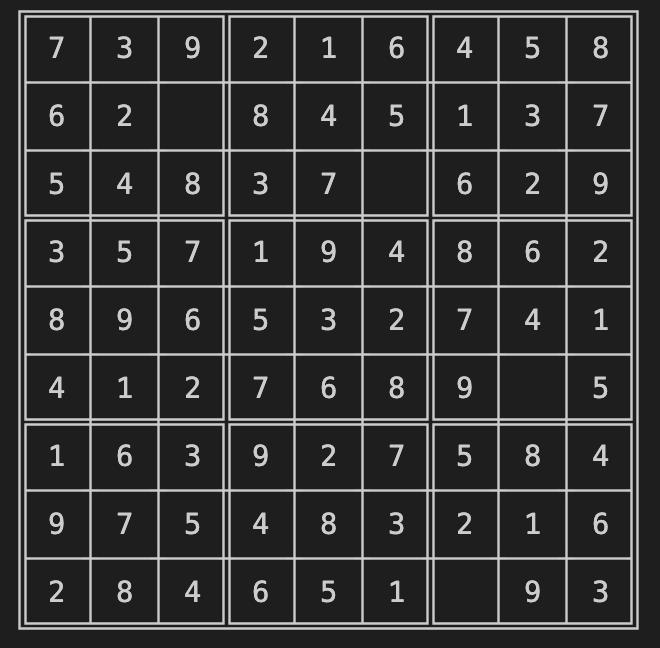

# Sudoku Puzzle Generator

This project is a simple command line tool to quickly generate sudoku puzzles using a wave function collapse algorithm. The tool saves all generated puzzles in an easy to use json format, found in the `app/output_puzzles/` directory.



## Get Started

This is a gradle project, so it should be fairly easy to download and compile, if you are familiar with the gradle build tool. In the project directory run the following command first, in order to compile the project.

```
gradle build
```

Once the project is built you can then run following command to run the tool.

```
gradle run --args="10"
```

That will run the tool to generate 10 sudoku puzzles. Of course, you can change 10 to any other positive integer, to generate however many puzzles your heart desires. The puzzles will be printed to console and saved as json files in the output_puzzles directory in the `app/output_puzzles/ directory.`

## Wave Function Collapse

My implementation of the Wave Function Collapse (WFC) algorithm likely not the simplest, or most elegant, but it works! 

The WFC algorithm starts by first initiaiting an empty puzzle. Then a random row and column is picked for a starting square, along with a random number between 1-9 selected for that square. This choice is then propagated to all squares in the same row, column and block, limiting the number possible values those squares can assume. We use an entropy value to keep track of the number of possible values a square can assume. We maintain a min queue based on the entropy value of all unassigned square. The next square is the square with the lowest entropy, which is then popped off the queue, assigned a random possible value, after which the queue is updated. Rinse and repeat until the whole puzzle is filled or we produce a failed puzzle. Failed puzzles are puzzle configurations where there are empty squares but there are no possible values that can fill that square (see the image below). In these cases, we just start over. The algorithm is fairly fast and implementing backtracking mechanisms would have made the code messier than it needed to be.


